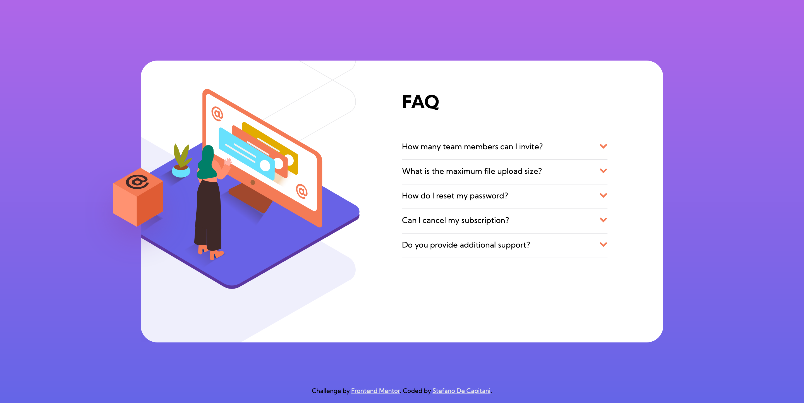

# Frontend Mentor - FAQ accordion card solution

This is a solution to the [FAQ accordion card challenge on Frontend Mentor](https://www.frontendmentor.io/challenges/faq-accordion-card-XlyjD0Oam). Frontend Mentor challenges help you improve your coding skills by building realistic projects.

## Table of contents

- [Overview](#overview)
  - [The challenge](#the-challenge)
  - [Screenshot](#screenshot)
  - [Links](#links)
- [My process](#my-process)
  - [Built with](#built-with)
  - [What I learned](#what-i-learned)
  - [Useful resources](#useful-resources)
- [Author](#author)
- [Acknowledgments](#acknowledgments)

## Overview

### The challenge

Users should be able to:

- View the optimal layout for the component depending on their device's screen size
- See hover states for all interactive elements on the page
- Hide/Show the answer to a question when the question is clicked

### Screenshot



### Links

- Solution URL: [https://github.com/StefanoDeCapitani/faq-accordion-card](https://github.com/StefanoDeCapitani/faq-accordion-card)
- Live Site URL: [https://stefanodecapitani.github.io/faq-accordion-card/](https://stefanodecapitani.github.io/faq-accordion-card/)

## My process

### Built with

- Semantic HTML5 markup
- CSS custom properties
- Flexbox

### What I learned

I tried to solve the challenge avoiding Javascript and found a way to get the expected result customizing the "Checkbox hack". I found it on the internet. I also learned to use "~" as general sibling selector in CSS. It is really helpful!

```html
<label>
  <input type="radio" name="faq" class="radio">
  <p class="question">How many team members can I invite?</p>
  
  <p class="answer">You can invite up to 2 additional users on the Free plan. There is no limit on
    team members for the Premium plan.</p>
</label>
```
```css
input.radio {
  position: absolute;
  opacity: 0;
}

input.radio:checked~p.question {
  font-weight: 700;
}

input.radio:checked~p.question:hover {
  color: black;
  cursor: default;
}

input.radio:checked~img.arrow-icon {
  transform: scaleY(-1);
}

input.radio:checked~p.answer {
  display: inline-block;
}
```

### Useful resources

- [The Checkbox Hack](https://css-tricks.com/the-checkbox-hack/) - This article helped me very much finding a way to make a paragraph appear when clicking on another one without the use of Javascript.


## Author

- Frontend Mentor - [@StefanoDeCapitani](https://www.frontendmentor.io/profile/StefanoDeCapitani)
